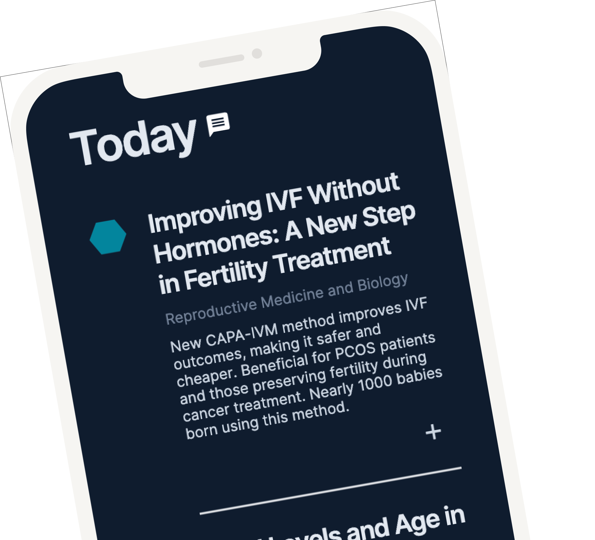

---
hide:
  - navigation
  - toc
---

{ align=right width="300" }

# Make Medical Papers Accessible

[Sign Up](https://tally.so/r/w8roVo){ .md-button }

## Our Mission

We're building a platform that makes the latest medical research clear, accessible, and trustworthy—for everyone.

Misinformation in health is everywhere—and if you're not a medical professional, it's nearly impossible to know what's true, what's outdated, or what's just plain wrong.

Medical science advances every day, yet most of us are still making decisions based on years-old advice. We believe you deserve better.

As female founders, we’re starting with PCOS — a condition that affects millions, yet is misunderstood, under-diagnosed, and too often dismissed. We want to change that—by giving people the knowledge they need to advocate for their own health.

### Follow Us [:fontawesome-brands-bluesky:](https://bsky.app/profile/hexplainai.bsky.social) [:fontawesome-brands-x-twitter:](https://x.com/hexplainAI)