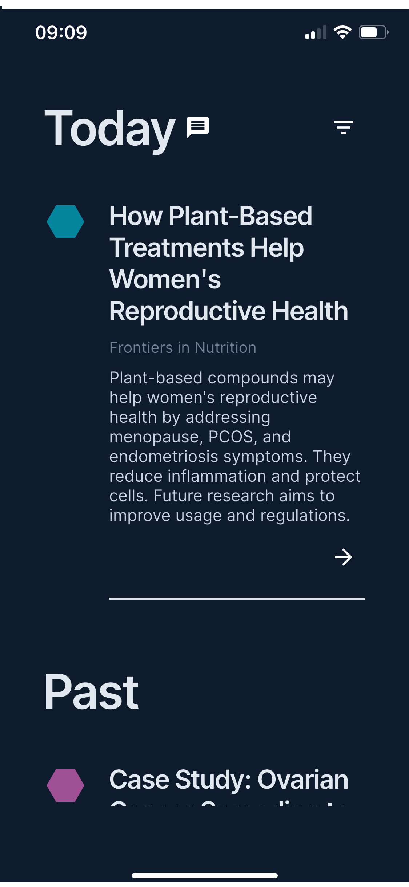
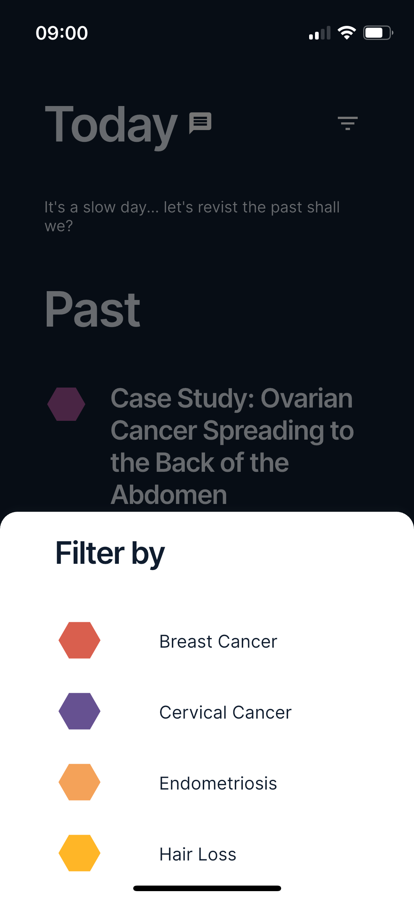
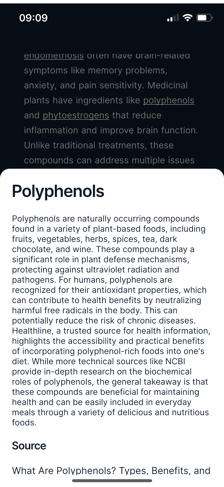

---
hide:
  - navigation
  - toc
---
<h1 style="text-align: left; font-size: 36px; font-weight: bold">Credible, Accessible & Up-to-Date Medical Information</h1>

Health misinformation is everywhere, and at Hexplain, we believe you deserve better — empowering you with the knowledge to advocate for your health.

[{ align=left width="140" }](https://apps.apple.com/us/app/hexplainai/id6744439167?platform=iphone)

   

  
Features

  

    

      
Simplified Latest Medical Paper

    
    

    

      
Filter by Topic

      
    

    

      
Terminology Simplified

      
    

  

  
Pricing

  

    

      
<strong>Free</strong>

      

      

        <ul style="text-align: left; list-style-type: disc; margin-left: 20px;">
          <li>Access up to Latest 50 Simplified Medical Paper per Topic</li>
          <li>Medical Terminology Simplified with Clear, Concise Definitions from Credible Sources</li>
          <li>Interactive Visuals for Easy Comprehension</li>
          <li>Filter Papers by Topic (e.g. Prostate Cancer, PCOS) and Paper Type (e.g. clinical trials, meta-analysis)</li>
        </ul>
      
  
      <a href="https://apps.apple.com/us/app/hexplainai/id6744439167?platform=iphone">
        <button class='custom-button'>
          iOS
        </button>
      </a>
      <a href="https://tally.so/r/w8roVo">
        <button class='custom-button'>
          Android (Alpha Testing)
        </button>
      </a>
    

    

      
<strong>Premium (Coming Soon)</strong>

      

      

        <ul style="text-align: left; list-style-type: disc; margin-left: 20px;">
          <li>Unlimited access to Simplified Medical Paper per Topic in the past 5 years</li>
          <li>Medical Terminology Simplified with Clear, Concise Definitions from Credible Sources</li>
          <li>Interactive Visuals for Easy Comprehension</li>
          <li>Add up to 5 Self-defined Topics of Interest</li>
          <li>Summary of the latest advancements in the topic</li>
          <li>Personalised alerts</li>
        </ul>
      
 
      <a href="https://tally.so/r/w8roVo">
        <button class='custom-button'>
          Be Part of Alpha
        </button> 
      </a>
    

    

      
<strong>Enterprise</strong>

      

      

        <ul style="text-align: left; list-style-type: disc; margin-left: 20px;">
          <li>Unlimited access to Simplified Medical Paper per Topic</li>
          <li>Unlimited customised topics</li>
          <li>API access for Integration</li>
          <li>Enterprise Support</li>
        </ul>
      
  
      <a href="mailto:hello@spacetu.ai" class="email-button">
        <button class='custom-button'>
          Contact Us
        </button> 
      </a>
    

  

  

<!-- [Sign Up](https://tally.so/r/w8roVo){ .md-button } -->

### Follow Us [:fontawesome-brands-bluesky:](https://bsky.app/profile/hexplainai.bsky.social) [:fontawesome-brands-x-twitter:](https://x.com/hexplainAI)
